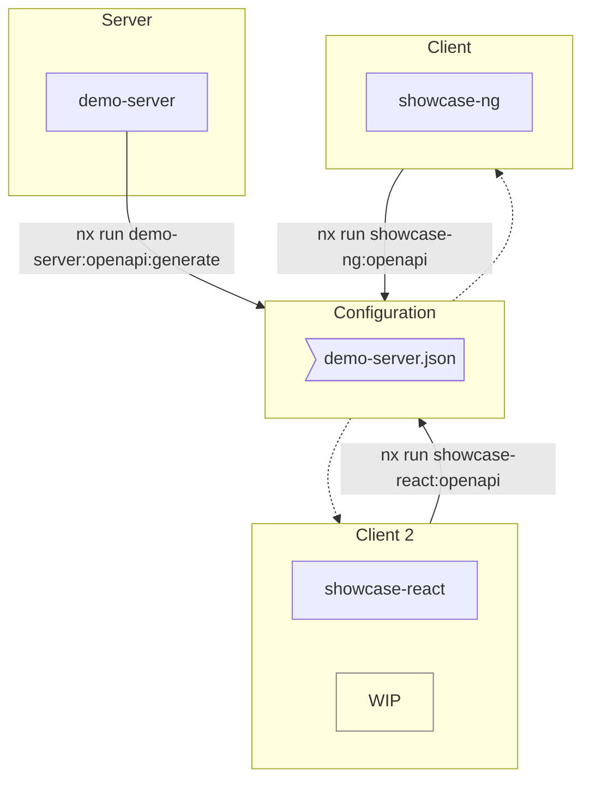

# Openapi Experiments

This repo contains some snippets to generate and consume OpenApi Specifications.

## Workflow

The server created an OpenApi-Spec `./dist/openapi/demo-server.json`. Each client can consume it to generate data from it.



## Try it out

```
# Load OpenApi definitions for demo-server
nx run demo-server:openapi:load
# Create OpenApi definitions that can be reused by others
nx run demo-server:openapi:generate
# Load OpenApi definitions for showcase app
nx run showcase-ng:openapi

# Run Server
nx run demo-server:serve
# Run Frontend
nx run showcase-ng:serve
```
